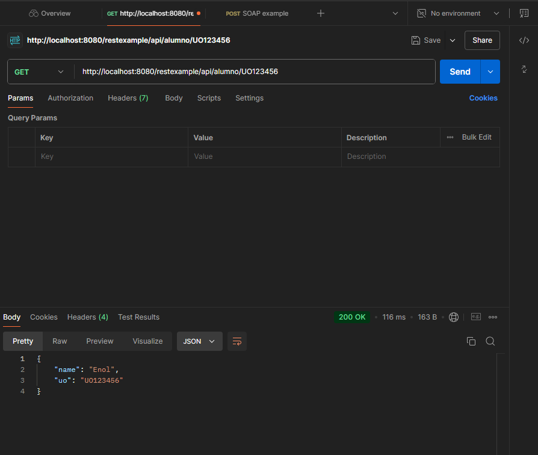

<p align="center">
  
</p>

# Deploying the Application

The application is deployed on a Wildfly server, in the same way that the *gestioneitor* applications are deployed. 
To verify how it works, you can test it using the following `curl` command:

```bash
curl --location 'http://localhost:8080/restexample/api/alumno/UO123456'
```

Alternatively, you can use Postman to perform the test:

