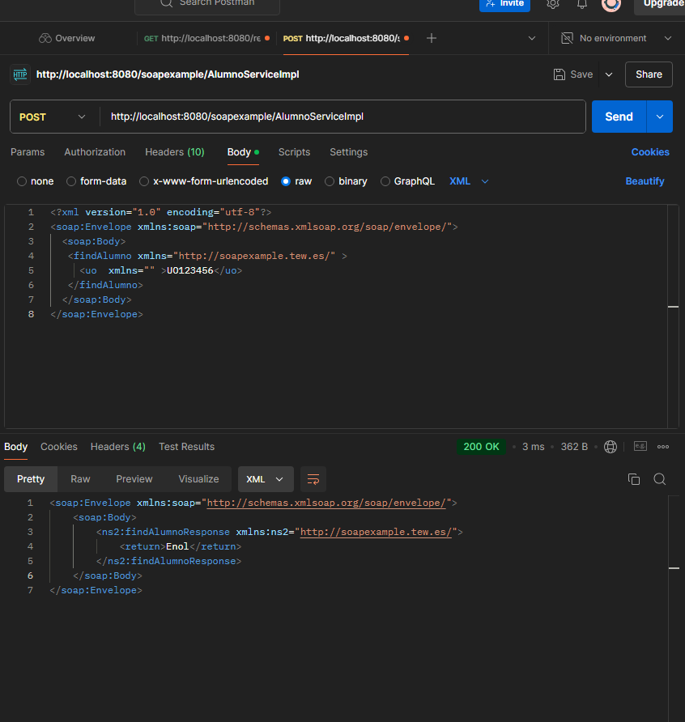

<p align="center">
  
</p>

# Deploying the Application

The application is deployed on a Wildfly server, in the same way that the *gestioneitor* applications are deployed. 
To verify how it works, you can get the WSDL file which describes all the operations available in the server. This WSDL file is available on: http://localhost:8080/soapexample/AlumnoServiceImpl?wsdl

In order to invoke mehtods, you can use the following `curl` command:

```bash
curl --location 'http://localhost:8080/soapexample/AlumnoServiceImpl' \
--header 'Content-Type: text/xml' \
--data '<?xml version="1.0" encoding="utf-8"?>
<soap:Envelope xmlns:soap="http://schemas.xmlsoap.org/soap/envelope/">
  <soap:Body>
   <findAlumno xmlns="http://soapexample.tew.es/" >
     <uo xmlns="">UO123456</uo>
   </findAlumno>
  </soap:Body>
</soap:Envelope>'
```

Alternatively, you can use Postman to perform the test:

